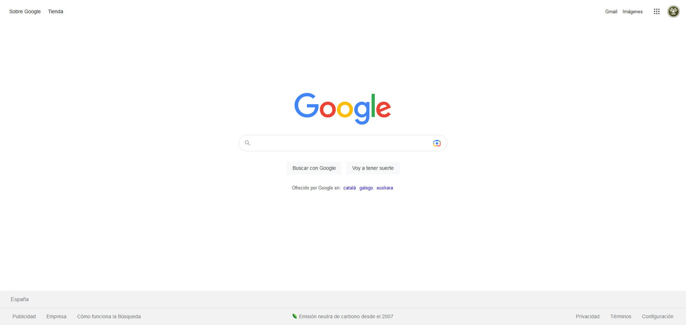

# 🔬 Clonando la página de Google

Practicando con las infinitas posibilidades que nos ofrecen HTML5 & CSS para clonar páginas estáticas.

### 🧷 Etiquetas semánticas principales:

- Header
- Main
- Footer

En la parte superior, que corresponde a la etiqueta header, tenemos un nav, con 3 enlaces y un ícono (que corresponde a la imagen cargada en la cuenta del correo electrónico utilizado).

# HEADER

En el header, tenemos la barra de navegación, cuya etiqueta correspondiente es nav (tanto a la derecha como a la izquierda, con algunos enlaces a otras páginas de Google).

# MAIN

Aquí vemos claramente el logo de Google centrado, con las siguientes partes:

- Input
- Lupa (ícono de búsqueda, en el margen izquierdo)
- Cámara de fotos (ícono de imágenes, en el margen derecho)

# FOOTER

A pie de página con una doble barra que ocupa todo el ancho disponible, con información y enlaces:

Primera barra del footer:

- España (país desde donde nos conectamos)

Segunda barra del footer:

- Publicidad
- Empresa
- Cómo funciona la búsqueda
- Privacidad
- Términos
- Configuración

En mitad del footer (de la segunda barra):

- Emisión neutra del carbono desde el 2007

